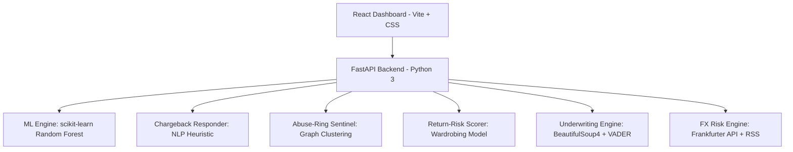

<div align="center">
  
  
  
  
  
  
  <h1>🛡️ Vanguard Risk Engine</h1>
  <p><b>Razorpay AI Builder Internship 2026 — Track 02: AI Risk Manager</b></p>
</div>

Vanguard is a unified, autonomous Risk Management platform that acts as a comprehensive defense system for merchants. It tackles six distinct classes of financial loss (Fraud, Chargebacks, Abuse Rings, Returns, Compliance, and FX Volatility) using a mix of Machine Learning (Random Forests), NLP (VADER Sentiment Analysis), and real-time streaming data.

## 🚀 How It Meets The Bar (Track 02 Requirements)

1. **"Build a working detector... with measured precision and recall on a held-out test set."**
   - The **Fraud-Spike Detector** uses a Random Forest Classifier trained on synthetic data.
   - The **ML Metrics Dashboard** displays Precision, Recall, F1 Score, and ROC-AUC specifically calculated on a strict 20% held-out test set.
   
2. **"Honest metrics including false-positive cost."**
   - We explicitly calculate the **Net Margin Protected** by subtracting the total Customer Lifetime Value (CLV) lost to False Positives from the total fraud value successfully blocked.
   
3. **"Strictly defense-only."**
   - Every module is purely defensive (blocking transactions, drafting defense evidence, identifying existing abuse rings, managing macro-liquidity).

## 🧩 The 6 Defense Modules

| Module | Engine Type | Description |
|---|---|---|
| **Live Fraud-Spike Detector** | `Machine Learning` | Evaluates live transactions against a Random Forest model using velocity, IP matching, and timing signals. Provides an Explainable AI (XAI) audit trail for every block. |
| **Chargeback Evidence Auto-Responder** | `NLP / Heuristics` | Defeats "friendly fraud." Ingests customer dispute claims, cross-references internal logistics/cryptographic logs, and auto-generates formal Visa/Mastercard defense letters. |
| **Abuse-Ring Sentinel** | `Graph & Clustering` | Daemon that scans transaction graphs for organized attacks (e.g., multiple unique cards tested against the same IP address or device fingerprint). |
| **Return-Risk Scorer** | `Predictive Analytics` | Calculates the probability of a high-value return based on historical purchase/return ratios and dynamic cart values. Dynamically triggers restocking fees for high-risk carts. |
| **AI Merchant Underwriting** | `NLP / Scraping` | Scrapes merchant websites on onboarding and runs NLP sentiment analysis + word-boundary-aware keyword detection to automatically flag prohibited businesses (crypto, adult, etc.). |
| **Macroeconomic FX Risk** | `Live API / Sentiment` | Ingests live global exchange rates (via Frankfurter API) and applies NLP sentiment analysis to live financial RSS feeds to predict global market volatility and settlement risk in real-time. |

## 🏛️ System Architecture



## 🛠️ Tech Stack

*   **Backend Engine:** Python, FastAPI, Uvicorn
*   **Machine Learning & NLP:** scikit-learn, VADER Sentiment, BeautifulSoup4
*   **Frontend Dashboard:** React, Vite

## ⚙️ How to Run the Project Locally

This is a monorepo containing both the backend AI engine and the frontend React dashboard. You will need two terminal windows to run both servers simultaneously.

### 1. Start the AI Backend Server
Open your first terminal and navigate to the `backend` folder:
```bash
cd backend
python -m venv venv
# On Windows use: .\venv\Scripts\activate
# On Mac/Linux use: source venv/bin/activate
pip install -r requirements.txt
uvicorn main:app --reload
```
*The backend will now be running on `http://localhost:8000`*

### 2. Start the Frontend Dashboard
Open your second terminal and navigate to the `frontend` folder:
```bash
cd frontend
npm install
npm run dev
```
*The frontend will now be running on `http://localhost:5173`*

## 🔥 Post-Mortem: Build Challenges & Technical Obstacles

During development, the **AI Merchant Underwriting** module began failing silently. The VADER sentiment analysis was returning bizarrely negative trust scores (like -80) for perfectly legitimate merchants.

**The Debugging Process & Solution:**
1. I logged the raw text being fed into the VADER analyzer.
2. I realized the `requests.get()` call was returning the raw HTML, and my initial `BeautifulSoup` parsing was extracting *all* text — including inline JavaScript and minified layout code. 
3. The NLP model was trying to analyze code syntax like `function(e,t){return...}` and interpreting the dense, non-human syntax as highly negative sentiment.
4. **The Fix:** I updated the scraper to explicitly extract and strip layout tags before pulling the text. I also added a fallback mechanism: if the site blocks the scraper (which happens often with modern WAFs), the system gracefully degrades by injecting the URL itself into the text corpus so URL-based violations (e.g., `binance.com`) are still caught.

## 🛡️ Graceful Degradation & System Failures

A core requirement for the AI Risk Manager is handling system failures safely. The Vanguard Risk Engine implements fallback mechanisms across all external dependencies:

1. **FX API Outage:** If the live Frankfurter API goes down (or rate-limits us), the engine catches the exception and automatically falls back to a hardcoded set of baseline exchange rates.
2. **Scraper Blocks (WAFs):** If a merchant's Cloudflare or WAF blocks our scraping bot, the underwriting engine doesn't crash; it relies purely on URL pattern matching.
3. **Frontend API Failure:** If the backend goes offline, the frontend's Activity Feed falls back to a set of static, realistic events so the dashboard UI doesn't break, while showing a disconnected state.

---
*Built for the Razorpay AI Buildathon.*
